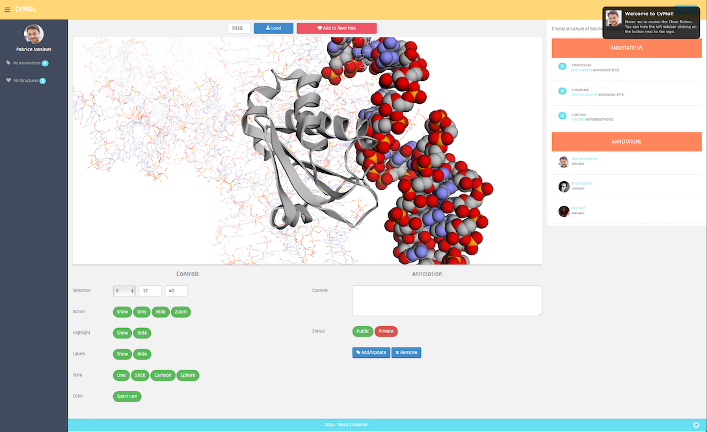

CyMol -- A Community Molecular Viewer
=====================================

This 3D viewer is based on Node.js and [3Dmol.js](http://3dmol.csb.pitt.edu)

To run it, type in the project directory:

    $ npm install
    $ cd node_modules/mongodb
    $ npm install
    $ cd ../..
    $ node server.js

Open your browser at http://localhost:3000/

